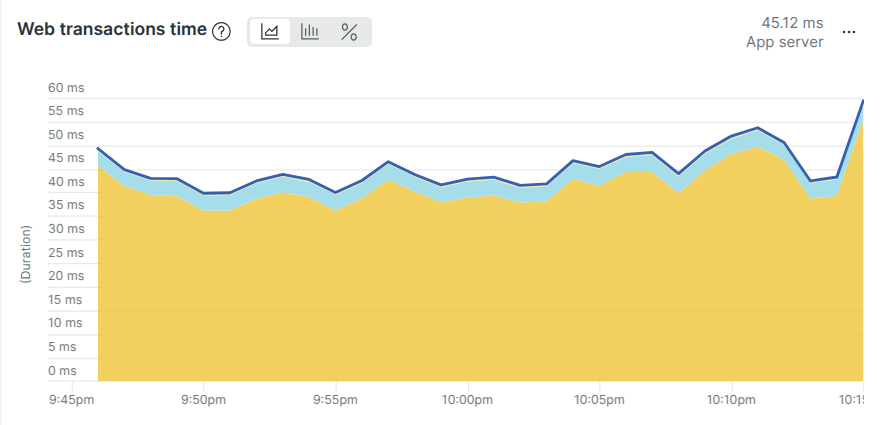

````markdown
# Sports Score Leaderboard System

## Table of Contents
- [Setup Instructions](#setup-instructions)
- [High-Level Design (HLD)](#high-level-design-hld)
- [Low-Level Design (LLD)](#low-level-design-lld)
- [Design Rationale](#design-rationale)
- [Features](#features)
- [API Reference](#api-reference)
- [New Relic Setup](#new-relic-setup)
- [Notes](#notes)

---

````

### New Relic screenshot under simulated traffic
this traffic can be simulated using this management command populate_and_simulate



### UI screenshot under simulated traffic


## Setup Instructions

### Docker (Recommended)

1. Build and start all services:
   ```bash
   docker-compose up --build


2. Backend: [http://localhost:8000](http://localhost:8000)
3. Frontend: [http://localhost:3000](http://localhost:3000)
4. PostgreSQL and Redis are exposed on default ports (5432, 6379).

### Backend (Manual)

1. Install dependencies:

   ```bash
   pip install -r backend/requirements.txt
   ```
2. Configure PostgreSQL and Redis in `backend/scoreboard/settings.py`.
3. Apply migrations:

   ```bash
   cd backend
   python manage.py makemigrations
   python manage.py migrate
   ```
4. Start the development server:

   ```bash
   python manage.py runserver
   ```

### Frontend (Manual)

1. Install dependencies:

   ```bash
   cd frontend
   npm install
   ```
2. Start the React app:

   ```bash
   npm start
   ```

---

## High-Level Design (HLD)

### Architecture Overview

* **Frontend:** React + Tailwind CSS UI with leaderboard display, rank lookup, and score submission.
* **Backend:** Django (no DRF), modular class-based views.
* **Database:** PostgreSQL with indexing and window functions for efficient rank computation.
* **Cache/Queue:** Redis for caching and as Celery broker.
* **Task Queue:** Celery workers recalculate leaderboard ranks in batch jobs.
* **Monitoring:** New Relic APM instrumentation.
* **Containerization:** Docker Compose manages all services.

### Data Flow

1. A user submits a score via API.
2. A `GameSession` entry is created; a Redis `dirty` flag is set.
3. Celery Beat periodically triggers a rank recalculation task.
4. Celery Worker recomputes leaderboard ranks via SQL and updates the `Leaderboard` table.
5. Leaderboard and rank data are cached in Redis for fast reads.
6. Frontend consumes this cached data via API endpoints.

---

## Low-Level Design (LLD)

### Backend Structure

* **`leaderboard/models.py`**

  * `User`: Authenticated users.
  * `GameSession`: Stores each score submission.
  * `Leaderboard`: Stores total score and rank per user.

* **`leaderboard/views.py`**

  * `SubmitScoreView`: Validates input, records GameSession, sets Redis dirty flag, invalidates user rank cache.
  * `TopLeaderboardView`: Returns top 10 leaderboard entries from cache or DB.
  * `UserRankView`: Returns a user's rank/score from cache or dynamically aggregates from GameSessions if absent.

* **`leaderboard/tasks.py`**

  * `recalculate_leaderboard`: Atomic raw SQL + Redis cache cleanup + mutex locking.
  * `update_leaderboard_ranks`: Celery task that checks dirty flag and triggers recalculation.

* **`leaderboard/cache.py`**

  * Redis helper methods for get/set/delete.

* **`scoreboard/celery.py`**

  * Celery app configuration using Redis.

* **`leaderboard/management/commands/populate_and_simulate.py`**

  * Simulates load testing by generating users and submitting random scores.

---

### Caching & Consistency

* Cached data includes top 10 leaderboard and per-user rank/score.
* Redis `leaderboard:dirty` flag tracks when recalculation is needed.
* Caches are invalidated:

  * On score submission (per-user rank).
  * After recalculation (top 10 and all user ranks).

---

### Concurrency & Atomicity

* GameSession creation is wrapped in `transaction.atomic()` for consistency.
* Leaderboard is updated only by the batch process (not during score submission).
* Redis mutex ensures one recalculation job runs at a time.
* `Leaderboard.user` is a `OneToOneField` to prevent duplicates.

---

### Error Handling

* Input validation on all views.
* Graceful fallback if `Leaderboard` entry doesn't exist for a user.
* JSON 404 response for missing users.
* (Recommended) Add logging and retry handling in production.

---

### Scaling

* Celery workers can be scaled horizontally.
* PostgreSQL and Redis are production-grade and tunable.
* Leaderboard recalculation uses efficient raw SQL (window function over indexed columns).

---

## Design Rationale

* **Django ORM:** Clean and reliable modeling.
* **PostgreSQL:** Advanced SQL features for ranking and aggregation.
* **Redis:** Low-latency caching and distributed locking.
* **Celery:** Asynchronous task handling.
* **React:** Modern frontend UX.
* **New Relic:** Real-time monitoring and error tracking.
* **Docker:** Easy dev/prod parity and scalability.

---

## Features

* Live-updating top 10 leaderboard
* Individual rank lookup by user ID
* Score submission simulation interface
* Redis caching for leaderboard and rank data
* Raw SQL window function for accurate ranking
* Background recalculation via Celery
* Dockerized setup for backend/frontend/infra
* New Relic instrumentation for APM
* Unit tests for backend APIs and caching

---

## API Reference

### Submit Score

`POST /api/leaderboard/submit`
Body:

```json
{
  "user_id": 123,
  "score": 42
}
```

### Get Top 10 Leaderboard

`GET /api/leaderboard/top`

### Get User Rank

`GET /api/leaderboard/rank/<user_id>`

---

## New Relic Setup

* Enabled via:

  ```bash
  newrelic-admin run-program gunicorn ...
  ```
* Config: `backend/newrelic.ini`
* Required:

  * `NEW_RELIC_LICENSE_KEY`
  * `NEW_RELIC_CONFIG_FILE=backend/newrelic.ini`
* Optional:

  * `NEW_RELIC_ENVIRONMENT=production`

> If `newrelic.ini` is excluded from source control, ensure it’s copied at deploy time.

---

## Notes

* For advanced scaling, customization, or architecture decisions, refer to HLD/LLD.
* Code is annotated with comments for important logic, especially caching and raw SQL.

```
